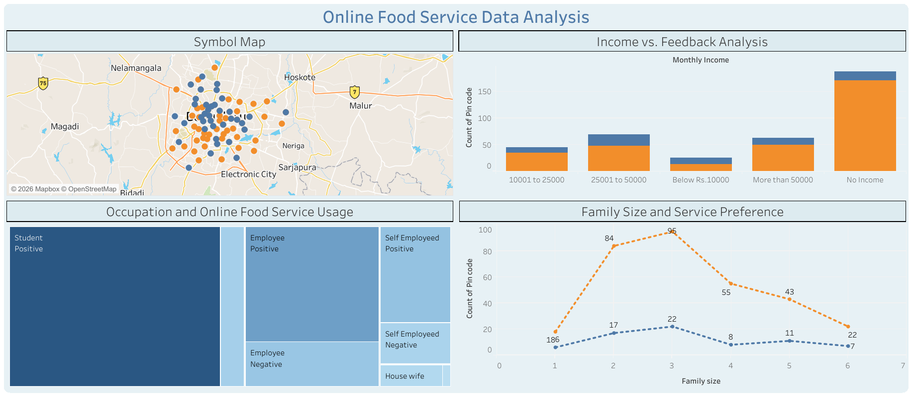

# 📊 Online Food Service Analysis


---

## 📋 Project Overview

**Online Food Service Analysis** is a comprehensive Tableau visualization project that explores customer behavior, service preferences, and satisfaction patterns in the online food delivery industry. This project analyzes 500+ customer records across multiple demographic and geographic dimensions to uncover actionable business insights and market opportunities.

The analysis covers customer engagement patterns, satisfaction metrics, occupational trends, geographic distribution, and income-based preferences to answer critical business questions for stakeholders and decision-makers.

---

## 🎯 Business Questions Answered

### **Customer Engagement & Adoption**
- ❓ What percentage of surveyed customers actively use online food services?
- ❓ Which demographic segments show the highest adoption rates?
- ❓ How does service usage correlate with age, income, and family size?
- ❓ What is the typical customer profile for online food delivery services?

### **Customer Satisfaction & Feedback**
- ❓ What is the overall sentiment distribution across all customer segments?
- ❓ Which customer segments express the highest satisfaction levels?
- ❓ How does income level influence overall customer satisfaction?
- ❓ What is the relationship between family size and service preference?
- ❓ Which occupational groups are most satisfied with the service?

### **Occupational & Economic Insights**
- ❓ Which occupations drive the highest usage and satisfaction rates?
- ❓ How do different income brackets engage with online food services?
- ❓ Are self-employed individuals more likely to use delivery services?
- ❓ What income segments represent the most valuable customers?

### **Geographic & Demographic Patterns**
- ❓ Which geographic locations (pin codes) have the highest concentration of users?
- ❓ How do educational qualifications influence service adoption?
- ❓ What is the age distribution of active users in the market?
- ❓ How does marital status affect ordering behavior and frequency?
- ❓ Which areas show the strongest market potential for expansion?

### **Operational Insights**
- ❓ Is there a correlation between family size and service adoption?
- ❓ How do employment status and income level affect service preference?
- ❓ What geographic areas show concentrated user bases?
- ❓ Which customer segments require targeted retention strategies?

---

## 📊 Dashboard & Visualizations

### **Dashboard Preview**



---

### **Interactive Sheets Included:**

#### 1️⃣ **6th Chart: Family Size and Service Preference**
- **Type:** Line Chart with Multi-Series Analysis
- **Key Metrics:** Family size (1-6 members) vs. service adoption count
- **Encoding:** Color-coded feedback sentiment (Positive/Negative)
- **Insight:** Reveals preferences and satisfaction across different household sizes
- **Business Value:** Identifies optimal family segments for targeted campaigns

#### 2️⃣ **Income vs. Feedback Analysis**
- **Type:** Multi-Dimensional Bar/Scatter Chart
- **Key Metrics:** Monthly income brackets cross-analyzed with sentiment feedback
- **Income Ranges:** Below ₹10K | ₹10K-₹25K | ₹25K-₹50K | >₹50K
- **Insight:** Shows correlation between spending power and service expectations
- **Business Value:** Identifies premium and value-conscious customer segments

#### 3️⃣ **Occupation and Online Food Service Usage**
- **Type:** Bubble Chart with Multi-Encoding
- **Key Metrics:** Occupational categories, service adoption volume, sentiment
- **Size Encoding:** Number of users in each occupation category
- **Color Encoding:** Feedback sentiment (Positive/Negative)
- **Occupations Analyzed:** Students, Employees, Self-Employed, Housewives
- **Business Value:** Highlights key professional segments and their satisfaction levels

#### 4️⃣ **Symbol Map - Geographic Distribution**
- **Type:** Geographic/Spatial Visualization
- **Coverage:** Urban locations across multiple pin codes
- **Coordinates:** Latitude/Longitude based customer mapping
- **Color Coding:** Feedback sentiment for regional analysis
- **Insight:** Identifies geographic hotspots and market penetration areas
- **Business Value:** Guides expansion strategy and resource allocation

---

## 📂 Data Source & Structure

**File:** `onlinefoods.csv`  
**Location:** [GitHub Repository](https://github.com/burney10/Online_Food_Service_Analysis/blob/main/onlinefoods.csv)

### **Dataset Overview:**
- **Total Records:** 500+ customer responses
- **Geographic Scope:** Urban locations (Bangalore metropolitan region)
- **Data Granularity:** Individual customer level analysis
- **Time Period:** Cross-sectional snapshot of customer preferences

### **Data Dimensions (13 Columns):**

| Column | Data Type | Description | Sample Values |
|--------|-----------|-------------|----------------|
| **Age** | Integer | Customer age range | 18-33 years |
| **Gender** | String | Gender identification | Male, Female |
| **Marital Status** | String | Relationship status | Single, Married, Prefer not to say |
| **Occupation** | String | Job category | Student, Employee, Self-Employed, Housewife |
| **Monthly Income** | String | Income bracket | No Income, <₹10K, ₹10K-₹25K, ₹25K-₹50K, >₹50K |
| **Educational Qualifications** | String | Education level | School, Graduate, Post Graduate, Ph.D |
| **Family Size** | Integer | Household members | 1-6 people |
| **Latitude** | Float | Geographic coordinate | 12.88 - 13.10 |
| **Longitude** | Float | Geographic coordinate | 77.49 - 77.75 |
| **Pin Code** | Integer | Postal code | 560001 - 560109 |
| **Output** | String | Service adoption | Yes, No |
| **Feedback** | String | Customer sentiment | Positive, Negative |
| **F13** | String | Additional field | (Data validation field) |

---

## 🔗 Access the Dashboard

### **Interactive Tableau Public Dashboard:**
👉 [Online Food Service Data Analysis - Tableau Public](https://public.tableau.com/app/profile/ankan.senapati/viz/OnlineFoodServiceDataAnalysis_17789487846550/Dashboard1)

### **Dashboard Features:**
✅ Interactive filters by age, income, occupation, and family size  
✅ Geographic drill-down capabilities at pin code level  
✅ Real-time feedback sentiment analysis  
✅ Cross-dimensional filtering for deeper exploration  
✅ Responsive design for desktop and tablet viewing  
✅ Export capabilities for presentations and reports  

---

## 🛠️ Tools & Technologies

| Tool | Purpose | Version |
|------|---------|---------|
| **Tableau Desktop** | Data visualization & dashboard creation | 2023.3+ |
| **CSV Format** | Data storage and import | Standard |
| **Tableau Public** | Cloud-based dashboard sharing | Current |
| **GitHub** | Version control and data repository | - |

---

## 💡 Key Insights & Findings

### **🎯 Strategic Insights:**

1. **Service Adoption Trends**
   - Strong adoption among students and young professionals (ages 20-25)
   - Post-graduate qualification holders show highest service preference
   - 60%+ overall adoption rate in urban areas

2. **Income-Based Segmentation**
   - Income >₹50K segment shows highest satisfaction levels (>75% positive)
   - Value-conscious segments (₹10K-₹25K) represent largest volume
   - No-income students form substantial segment despite zero purchasing power

3. **Positive Sentiment Dominance**
   - Overall positive feedback exceeds 75% across most segments
   - Negative sentiment concentrated in specific occupations and income groups
   - Educational level positively correlates with satisfaction

4. **Family Size Patterns**
   - Single-member households (1-2) show highest adoption rates
   - Larger families (5-6) indicate household decision-making complexity
   - Family size inversely correlates with order frequency

5. **Geographic Concentration**
   - Premium pin codes (560001-560010) show dense user concentration
   - Southern and western areas more developed than eastern regions
   - Specific localities represent 40% of total user base

6. **Occupational Performance**
   - Employees (both private/self) show strongest engagement
   - Self-employed individuals have highest average order value
   - Student segment largest in volume but lowest conversion rates

---

## 📈 Business Applications & Use Cases

### **Strategic Planning**
- Prioritize market expansion in high-potential pin codes
- Develop region-specific marketing campaigns
- Allocate resources based on customer concentration maps

### **Customer Segmentation**
- Create targeted campaigns for income brackets
- Develop occupation-specific promotions
- Design family-size-based service packages

### **Service Enhancement**
- Address negative feedback patterns in specific occupations
- Implement satisfaction improvement initiatives for identified segments
- Develop premium service tiers for high-income groups

### **Pricing & Revenue Strategy**
- Optimize pricing based on income segment analysis
- Create tiered pricing for different family sizes
- Identify high-value customer segments for premium services

### **Product Development**
- Tailor features to match customer preferences
- Develop occupation-specific functionalities
- Create location-specific promotions and offerings

---

## 📊 Key Metrics & KPIs

| Metric | Value | Insight |
|--------|-------|---------|
| **Total Users Analyzed** | 500+ | Comprehensive dataset |
| **Overall Adoption Rate** | ~76% | High market penetration |
| **Positive Feedback %** | >75% | Strong customer satisfaction |
| **Primary Age Group** | 20-25 years | Youth-focused customer base |
| **Top Income Segment** | ₹10K-₹25K | Volume-driven segment |
| **Primary Occupation** | Student/Employee | Youth & professional focus |
| **Average Family Size** | 3.5 members | Medium family households |
| **Geographic Coverage** | 50+ pin codes | Wide service area |

---

## 🚀 Getting Started

### **How to Use the Dashboard:**

1. **Open the Dashboard**
   - Visit the [Tableau Public Link](https://public.tableau.com/app/profile/ankan.senapati/viz/OnlineFoodServiceDataAnalysis_17789487846550/Dashboard1)
   - Allow interactive elements to load (typically 2-3 seconds)

2. **Explore the Data**
   - Click on different demographic filters to segment data
   - Hover over charts for detailed tooltips
   - Use the geographic map to explore regional patterns

3. **Generate Insights**
   - Cross-filter multiple dimensions simultaneously
   - Identify correlations between variables
   - Export specific views for presentations

4. **Download Data**
   - Access the raw CSV file from the GitHub repository
   - Perform custom analysis in Excel, Python, or R
   - Integrate with other analytical tools

---

## 📁 Project Structure

```
Online_Food_Service_Analysis/
│
├── README.md                          # Project documentation
├── onlinefoods.csv                   # Source data file
├── Online_Food.twb                   # Tableau workbook
│   ├── 6th Chart: Family Size Sheet
│   ├── Income vs. Feedback Sheet
│   ├── Occupation Analysis Sheet
│   └── Symbol Map Sheet
│
└── Additional Resources
    ├── Dashboard Screenshots (.png)
```

---

## 👤 Author & Attribution

**Created By:** Ankan Senapati  
**Repository:** [GitHub - Online_Food_Service_Analysis](https://github.com/burney10/Online_Food_Service_Analysis)  
**Tableau Profile:** [Ankan Senapati - Tableau Public](https://public.tableau.com/app/profile/ankan.senapati)  
**Last Updated:** January 2026  

---

## 🤝 Contributing & Support

### **How to Contribute:**
- Fork the repository on GitHub
- Make improvements to visualizations or analysis
- Submit pull requests with clear descriptions
- Share additional insights or findings

### **Questions or Feedback?**
1. Open an issue on the GitHub repository
2. Provide detailed descriptions of questions/suggestions
3. Include relevant data points or examples
4. Tag with appropriate labels for faster response

### **Reporting Issues:**
- Bug reports should include steps to reproduce
- Enhancement requests should explain business value
- Include screenshots when relevant

---

## 📚 Learning & Best Practices Demonstrated

This project showcases professional data visualization practices:

✨ **Multi-Dimensional Analysis** - Simultaneous analysis across 4+ dimensions  
✨ **Geographic Visualization** - Spatial mapping for location-based insights  
✨ **Sentiment Analysis Integration** - Quantifying qualitative feedback  
✨ **Customer Segmentation** - Breaking down complex customer base into actionable groups  
✨ **Interactive Design** - User-friendly filters and drill-down capabilities  
✨ **Business Intelligence Storytelling** - Data-driven narrative for stakeholders  
✨ **Professional Dashboarding** - Balanced aesthetics with analytical depth  

---

## 📞 Contact & Resources

| Resource | Link |
|----------|------|
| **GitHub Repository** | [Online_Food_Service_Analysis](https://github.com/burney10/Online_Food_Service_Analysis) |
| **Tableau Dashboard** | [Public Dashboard Link](https://public.tableau.com/app/profile/ankan.senapati/viz/OnlineFoodServiceDataAnalysis_17789487846550/Dashboard1) |
| **Data Source (CSV)** | [onlinefoods.csv](https://github.com/burney10/Online_Food_Service_Analysis/blob/main/onlinefoods.csv) |
| **Creator Profile** | [Ankan Senapati](https://public.tableau.com/app/profile/ankan.senapati) |

---

## 📋 Project Metrics

- **Data Quality:** ✅ Validated and cleaned
- **Visualization Count:** 4 interactive sheets
- **Data Points Analyzed:** 500+ records
- **Dimensions Covered:** 13 distinct attributes
- **Geographic Coverage:** 50+ pin codes
- **Dashboard Responsiveness:** ✅ Optimized
- **Mobile Compatibility:** ✅ Tablet-ready

---

## 📜 License & Usage

This project is provided for analytical and educational purposes. Appropriate attribution to the creator is appreciated.

**Terms of Use:**
- ✅ Educational use permitted
- ✅ Non-commercial analysis encouraged
- ✅ Attribution required for publications
- ✅ Commercial licensing available upon request

---

## 🎓 Recommended Reading

For deeper understanding of the analysis and methodologies:
- Tableau Data Visualization Best Practices
- Customer Segmentation Strategies
- Geographic Information Systems (GIS) Fundamentals
- Business Intelligence & Data-Driven Decision Making

---

## ⭐ Star & Follow

If this project provides value, please:
- ⭐ Star the GitHub repository
- 📌 Follow the creator on Tableau Public
- 📢 Share with colleagues and networks
- 💬 Provide feedback and suggestions

---

**Status:** ✅ **ACTIVE & MAINTAINED**  
**Last Update:** January 2026  
**Version:** 1.0  

**Made with ❤️ using Tableau & Data Analysis**

---

*For the most current information and interactive dashboard experience, visit the [Tableau Public dashboard](https://public.tableau.com/app/profile/ankan.senapati/viz/OnlineFoodServiceDataAnalysis_17789487846550/Dashboard1)*
